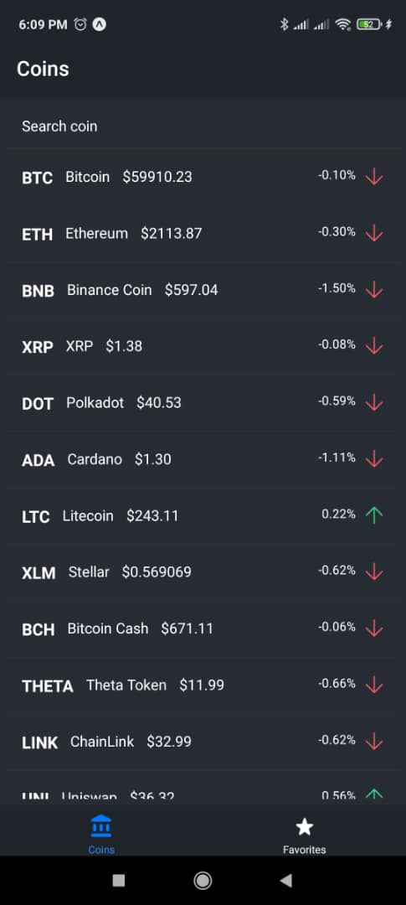
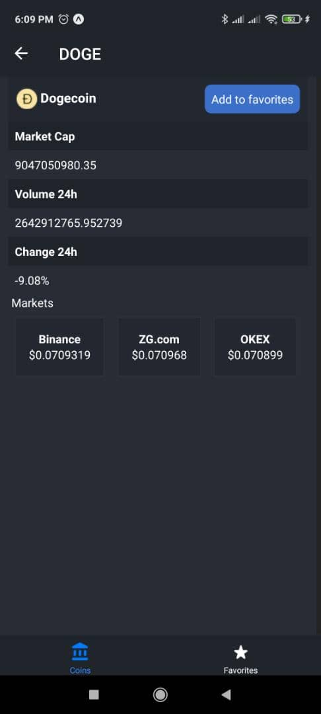
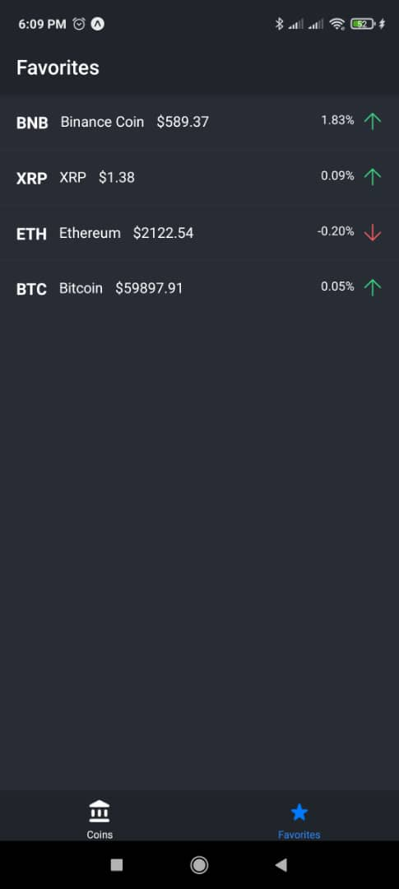

<h1 align='center'>Crypto Tracker</h1>

An application to track cryptocurrencies.

<ul>
  <li>
    <a href='#few-requirements'>Few Requirement</a>
  </li>
  <li>
    <a href='#getting-started'>Getting Started</a>
  </li>
  <li>
    <a href='#key-features'>Key Features</a>
  </li>
  <li>
    <a href='#acknowledgement'>Acknowledgement</a>
  </li>
</ul>
<h1 id='few-requirements'>Few Requirements</h1>
<ul>
  <li><a href='https://www.typescriptlang.org/download' target='_blank'>TypeScript</a></li>
  <li><a href='https://docs.expo.io/workflow/expo-cli/' target='_blank'>Expo cli</a></li>
</ul>

<h1 id='getting-started'>Getting Started</h1>

Run <code>npm install</code> and after run <code>npm start</code>.

Go to <a href='http://localhost:19002' target='_blank'>http://localhost:19002</a> and scan the qr code with your phone.

Or run <code>npm run android</code> or <code>npm run ios</code> to run an emulator on your respective platform.

<h1 id='key-features'>Key Features</h1>

<ul>
  <li>
    <h3>Crypto Home</h3>
    
A vertical list that shows the different cryptocurrencies, with their symbol, name, price and current and their percentage of change in the last hour.

    

      
    

    
Search cryptocurrencies

    <video width='150' height='350' 
      autoplay='true'
      loop='true'>
        <source src="./assets/github/filtering.mp4"
            type="video/mp4">
        Sorry, your browser doesn't support embedded videos.
      </video>
  </li>
  <li>
    <h3>Crypto Details</h3>
    
A screen to show more information about a cryptocurrency.

    

      
    

    

      A horizontal list that shows the markets where the cryptocurrency is allowed.
    

    

      <video width='150' height='350' 
      autoplay='true'
      loop='true'>
        <source src="./assets/github/horizontal-list.mp4"
            type="video/mp4">
        Sorry, your browser doesn't support embedded videos.
      </video>
    

    

      You can add and remove the cryptocurrency from favorites.
    

    

      <video width='150' height='350' 
      autoplay='true'
      loop='true'>
        <source src="./assets/github/add-remove-favorites.mp4"
            type="video/mp4">
        Sorry, your browser doesn't support embedded videos.
      </video>
    

  </li>
  <li>
    <h3>Crypto Favorites</h3>
    
Show all the cryptocurrencies you have added to favorites

    

      
    

  </li>
</ul>

<h1>Acknowledgement</h1>

This app was built following the react-native course on platzi, thanks to <a href='https://twitter.com/alesanabriav' target='_blank'>@alesanabriav</a> and <a href='https://platzi.com/' target='_blank'>platzi</a> for such a good course.

